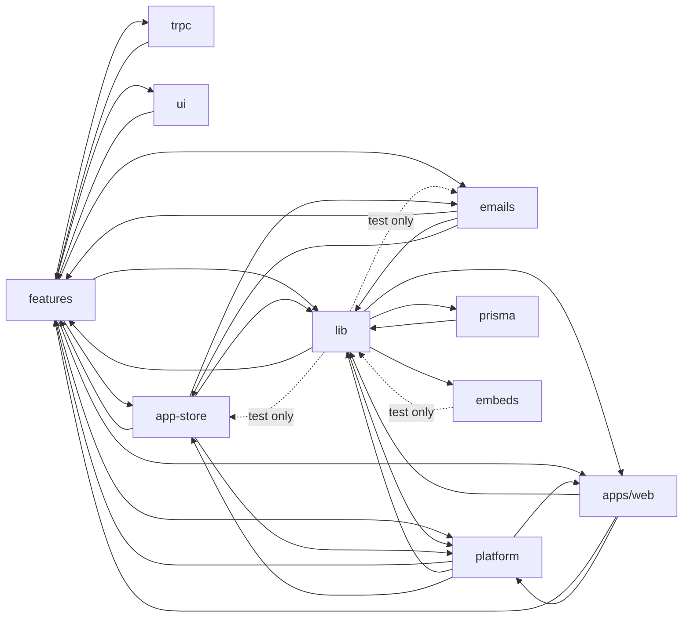

# Dependency analysis: `packages/*` and `apps/web`

## Overview

This report is generated from a real import graph, not from `package.json` declarations.
`@calcom/*` imports resolve through Yarn workspace symlinks and TypeScript path aliases,
so a package can (and many do) import far more workspaces than it declares.

Tooling (all at repo root):

| File | Purpose |
|---|---|
| `.dependency-cruiser.cjs` | dependency-cruiser config. Resolves TS path aliases via `tsconfig.depcruise.json`, keeps `import type` edges tagged as `type-only` (`tsPreCompilationDeps: "specify"`), excludes `node_modules`, `.next`, `dist`, generated Prisma/Zod output and `*.generated.*`. |
| `tsconfig.depcruise.json` | Minimal tsconfig exposing the `apps/web` path aliases (`~/*`, `@components/*`, `@lib/*`, `@server/*`, `@calcom/repository/*`, `@coss/ui/*`) so cross-package imports written from `apps/web` resolve. |
| `scripts/analyze-deps.mjs` | Aggregates the dependency-cruiser JSON into the matrix, fan-out/fan-in rankings, package-level cycles (value vs type-only, production vs test) and the undeclared-dependency table. |

Reproduce:

```bash
yarn depcruise --config .dependency-cruiser.cjs --output-type json \
  --output-to /tmp/depcruise.json --no-progress packages apps/web
node scripts/analyze-deps.mjs /tmp/depcruise.json          # markdown
node scripts/analyze-deps.mjs /tmp/depcruise.json --json   # raw data
```

Graph size (after the quick win below): 5,549 modules, 21,224 module-level dependencies.

Conventions used throughout:

- Cells are `importing files / import statements`.
- Nested workspaces are folded into their top-level directory: `packages/platform/*` -> `platform`,
  `packages/embeds/*` -> `embeds`, `packages/features/ee/*` -> `features`, etc. `ee` and `kysely` are the
  small `packages/ee` (`di`, `prisma-extensions`) and `packages/kysely` workspaces.
- "value" = import that survives compilation; "type-only" = `import type` / type-only re-export (erased,
  cannot create a runtime cycle).
- "test" = file matched by `*.test.*`, `*.spec.*`, `*.e2e.*`, `__tests__/`, `/test/`, `/tests/`, `/playwright/`, `__mocks__/`.
- `config`, `tsconfig`, `debugging`, `coss-ui`, `app-store-cli`, `types` and `dayjs` have no or negligible
  outgoing `@calcom/*` edges and are omitted from rows where they would be empty.

## Dependency matrix

Rows import columns (value + type-only imports).

| from \ to | apps/web | app-store | dayjs | emails | embeds | features | kysely | lib | platform | prisma | sms | trpc | types | ui |
|---|---|---|---|---|---|---|---|---|---|---|---|---|---|---|
| **apps/web** |  | 90/175 | 89/99 | 6/6 | 18/19 | 600/1208 |  | 755/1334 | 40/52 | 301/376 |  | 372/512 |  | 571/1772 |
| **app-store** | 7/11 |  | 12/12 | 5/6 |  | 62/100 |  | 241/471 | 1/1 | 148/184 |  |  |  | 50/107 |
| **app-store-cli** |  |  |  |  |  |  |  |  |  |  |  |  | 1/1 |  |
| **ee** |  |  |  |  |  | 2/4 |  |  |  | 1/1 |  |  |  |  |
| **emails** | 2/2 | 3/3 | 5/6 |  |  | 3/5 |  | 88/125 |  | 11/13 | 1/9 |  |  |  |
| **embeds** | 7/11 |  |  |  |  |  |  | 1/1 |  | 2/2 |  |  |  |  |
| **features** | 43/143 | 116/196 | 135/148 | 40/42 | 6/7 |  | 2/2 | 412/900 | 6/8 | 528/783 |  | 74/88 | 1/2 | 52/137 |
| **lib** | 1/2 | 1/1 | 23/28 | 2/2 | 4/4 | 3/4 |  |  | 1/1 | 31/42 |  |  | 1/1 |  |
| **platform** | 28/67 | 11/27 | 7/7 | 1/14 | 1/2 | 57/199 |  | 38/68 |  | 9/13 |  | 24/46 |  | 26/61 |
| **prisma** |  |  |  |  |  |  |  | 1/1 |  |  |  |  |  |  |
| **sms** |  |  | 1/1 |  |  | 2/4 |  | 9/13 |  | 2/2 |  |  |  |  |
| **trpc** |  | 47/73 | 13/15 | 12/12 |  | 302/650 | 2/3 | 146/273 |  | 306/457 |  |  |  | 1/2 |
| **ui** |  |  | 1/1 |  | 1/1 | 3/3 |  | 37/48 |  |  |  |  |  |  |

`apps/web -> packages/*` (first row) is the consumer view: the app touches ten workspaces, dominated by
`ui` (1,772 imports), `lib` (1,334), `features` (1,208) and `trpc` (512). Note also the reverse edges
*into* `apps/web`: `features` (43 files, 4 of them production), `platform` (28 files, all production),
and test files in `app-store`, `embeds`, `emails` reaching for `@calcom/web/test/*` helpers.

## Circular dependencies

Package-level cycles (A imports B and B imports A). `v` = value imports, `t` = type-only, `pv` = value
imports from production (non-test) files. A direction is "type-only" when `v = 0`, and "test-only" when
`pv = 0`.

| A | B | A -> B (files/imports; v, t, pv) | kind | B -> A | kind |
|---|---|---|---|---|---|
| features | trpc | 74/88 (v 60, t 28, pv 52) | runtime, production | 302/650 (v 607, t 43, pv 555) | runtime, production |
| features | ui | 52/137 (v 136, t 1, pv 136) | runtime, production | 3/3 (v 2, t 1, pv 2) | runtime, production |
| features | app-store | 116/196 (v 166, t 30, pv 135) | runtime, production | 62/100 (v 95, t 5, pv 85) | runtime, production |
| features | emails | 40/42 (v 41, t 1, pv 34) | runtime, production | 3/5 (v 5, t 0, pv 5) | runtime, production |
| features | lib | 412/900 (v 872, t 28, pv 792) | runtime, production | 3/4 (v 2, t 2, pv 1) | runtime, production (1 prod file) |
| features | platform | 6/8 (v 8, t 0, pv 8) | runtime, production | 57/199 (v 152, t 47, pv 152) | runtime, production |
| lib | prisma | 31/42 (v 39, t 3, pv 36) | runtime, production | 1/1 (v 1, t 0, pv 1) | runtime, production |
| lib | platform | 1/1 (v 1, t 0, pv 1) | runtime, production | 38/68 (v 68, t 0, pv 68) | runtime, production |
| lib | embeds | 4/4 (v 4, t 0, pv 4) | runtime, production | 1/1 (v 1, t 0, pv 0) | test-only |
| lib | emails | 2/2 (v 1, t 1, pv 0) | test-only | 88/125 (v 124, t 1, pv 120) | runtime, production |
| lib | app-store | 1/1 (v 1, t 0, pv 0) | test-only | 241/471 (v 462, t 9, pv 450) | runtime, production |
| app-store | emails | 5/6 (v 6, t 0, pv 6) | runtime, production | 3/3 (v 3, t 0, pv 3) | runtime, production |
| app-store | platform | 1/1 (v 1, t 0, pv 1) | runtime, production | 11/27 (v 23, t 4, pv 23) | runtime, production |
| apps/web | lib | 755/1334 | runtime, production | 1/2 (v 2, pv 2) | runtime, production |
| apps/web | features | 600/1208 | runtime, production | 43/143 (v 141, t 2, pv 4) | runtime, production (4 prod files) |
| apps/web | platform | 40/52 | runtime, production | 28/67 (v 57, t 10, pv 57) | runtime, production |
| apps/web | app-store | 90/175 | runtime, production | 7/11 (pv 0) | test-only |
| apps/web | embeds | 18/19 | runtime, production | 7/11 (pv 0) | test-only |
| apps/web | emails | 6/6 | runtime, production | 2/2 (pv 0) | test-only |

Findings for the candidates called out up front:

- **`features <-> trpc`** — confirmed, runtime, production in both directions. `trpc` is essentially a
  thin layer over `features` (650 imports), while `features` reaches back into `trpc` mostly for
  `@calcom/trpc/react` hooks and router input types (28 of 88 imports are type-only; the 60 value imports are
  the real back-edge).
- **`features <-> ui`** — confirmed, runtime. Back-edge is only 3 files:
  `ui/components/avatar/UserAvatarGroup.tsx`, `UserAvatarGroupWithOrg.tsx`, `calendar-switch/CalendarSwitch.tsx`.
- **`features <-> app-store`** — confirmed, runtime, production, and heavy in both directions
  (196 vs 100 imports). This is the largest true architectural cycle.
- **`features <-> emails`** — confirmed, runtime. Back-edge is 3 production files
  (`emails/email-manager.ts`, `templates/_base-email.ts`, `templates/organizer-request-email.ts`).
- **`prisma -> lib`** — confirmed, runtime, production, one file: `packages/prisma/zod-utils.ts` re-exports
  `eventTypeLocations`, `EventTypeLocation`, `eventTypeSlug` from `@calcom/lib/zod/eventType`. It is **not**
  type-only: `eventTypeSlug` uses `@calcom/lib/slugify`, and the generated Zod model schemas
  (`packages/prisma/zod/modelSchema/EventTypeSchema.ts`, produced from `@zod.import([...'../../zod-utils'])`
  annotations in `schema.prisma`) import both values. See "Quick win" for why this was *not* chosen.
- **`lib -> features`** — confirmed, but only 4 files before the quick win:
  `lib/domainManager/organization.ts` (value, production — the only real runtime back-edge),
  `lib/formatCalendarEvent.ts` (type-only), `lib/test/builder.ts` (value, test helper — **removed**),
  `lib/server/repository/selectedCalendar.test.ts` (value + type, test).
- Not in the original list but worth knowing: `lib -> platform` (`lib/hooks/useLocale.ts` imports
  `@calcom/atoms` hooks) and `lib -> embeds` (4 production files) make `lib` — nominally the leaf utility
  package — participate in six cycles.



Solid edges are runtime value imports from production code; dotted edges exist only in test files.

## Coupling hotspots

### Fan-out (distinct workspaces imported, value imports only)

| # | package | fan-out | targets (files/imports) |
|---|---|---|---|
| 1 | features | 12 | lib (412/900), prisma (528/783), app-store (116/196), dayjs (135/148), apps/web (43/143), ui (52/137), trpc (74/88), emails (40/42), platform (6/8), embeds (6/7), types (1/2), kysely (2/2) |
| 2 | apps/web | 10 | ui (571/1772), lib (755/1334), features (600/1208), trpc (372/512), prisma (301/376), app-store (90/175), dayjs (89/99), platform (40/52), embeds (18/19), emails (6/6) |
| 2 | platform | 10 | features (57/199), lib (38/68), apps/web (28/67), ui (26/61), trpc (24/46), app-store (11/27), emails (1/14), prisma (9/13), dayjs (7/7), embeds (1/2) |
| 4 | lib | 9 | prisma (31/42), dayjs (23/28), features (3/4), embeds (4/4), apps/web (1/2), emails (2/2), platform (1/1), types (1/1), app-store (1/1) |
| 5 | app-store | 8 | lib (241/471), prisma (148/184), ui (50/107), features (62/100), dayjs (12/12), apps/web (7/11), emails (5/6), platform (1/1) |
| 5 | trpc | 8 | features (302/650), prisma (306/457), lib (146/273), app-store (47/73), dayjs (13/15), emails (12/12), kysely (2/3), ui (1/2) |
| 7 | emails | 7 | lib (88/125), prisma (11/13), sms (1/9), dayjs (5/6), features (3/5), app-store (3/3), apps/web (2/2) |
| 8 | sms | 4 | lib, features, prisma, dayjs |
| 8 | ui | 4 | lib (37/48), features (3/3), dayjs (1/1), embeds (1/1) |
| 10 | embeds | 3 | apps/web (7/11, tests), prisma (2/2), lib (1/1) |
| 11 | prisma | 1 | lib (1/1) |

`features` confirms its role as the hub: it imports from every other significant workspace, including
`apps/web` itself (43 files, mostly `@calcom/web/test/*` fixtures but 4 production files) and `atoms`
under `platform`. `trpc` and `app-store` follow with 8 each.

### Fan-in (distinct workspaces importing this one)

| package | fan-in | importers |
|---|---|---|
| lib | 10 | apps/web, features, app-store, trpc, emails, platform, ui, sms, prisma, embeds |
| prisma | 10 | features, trpc, apps/web, app-store, lib, emails, platform, sms, embeds, ee |
| dayjs | 9 | features, apps/web, lib, trpc, app-store, platform, emails, sms, ui |
| features | 9 | apps/web, trpc, platform, app-store, emails, sms, lib, ee, ui |
| app-store | 6 | features, apps/web, trpc, platform, emails, lib |
| ui | 5 | apps/web, features, app-store, platform, trpc |
| trpc | 3 | apps/web, features, platform |

`lib`, `prisma` and `dayjs` are the de-facto foundation layer (fan-in 9–10). `features` has both the highest
fan-out and near-highest fan-in, which is what makes every cycle in the graph run through it.

### Tight coupling: real imports vs `package.json`

Only the top-level workspace's `package.json` was compared (nested workspaces such as
`@calcom/platform-*` or `@calcom/embed-*` are folded into their parent as import *targets*). Largest
undeclared edges, by production value imports:

| importer | undeclared target | files/imports | prod value imports |
|---|---|---|---|
| trpc | features | 302/650 | 555 |
| features | prisma | 528/783 | 515 |
| trpc | prisma | 306/457 | 349 |
| trpc | lib | 146/273 | 256 |
| app-store | prisma | 148/184 | 159 |
| platform | features | 57/199 | 152 |
| features | app-store | 116/196 | 135 |
| platform | lib / ui / apps/web / trpc / app-store | 38/68 · 26/61 · 28/67 · 24/46 · 11/27 | 68 · 58 · 57 · 37 · 23 |
| trpc | app-store | 47/73 | 68 |
| lib | prisma | 31/42 | 36 |
| features | emails | 40/42 | 34 |
| trpc | emails / dayjs | 12/12 · 13/15 | 12 · 15 |
| emails | prisma / sms / features / app-store | 11/13 · 1/9 · 3/5 · 3/3 | 7 · 9 · 5 · 3 |
| lib | embeds / apps/web / platform | 4/4 · 1/2 · 1/1 | 4 · 2 · 1 |
| ui | features / dayjs / embeds | 3/3 · 1/1 · 1/1 | 2 · 1 · 1 |
| sms | lib / features / prisma / dayjs | 9/13 · 2/4 · 2/2 · 1/1 | 12 · 3 · 1 · 1 |
| prisma | lib | 1/1 | 1 |

Specific observations:

- `packages/features/package.json` declares `@calcom/lib`, `@calcom/trpc`, `@calcom/ui`, `@calcom/dayjs`
  but not `@calcom/prisma` — its single largest dependency (783 imports).
- `packages/trpc/package.json` declares none of `features`, `prisma`, `lib`, `app-store`, `emails`,
  `dayjs`; the router layer is entirely undeclared coupling.
- `packages/platform/*` workspaces declare almost nothing and reach into `apps/web` (28 production files,
  e.g. `@calcom/web/modules/...`, `@calcom/web/public/static/locales/*`), which inverts the intended
  app -> packages direction.
- `packages/lib` is supposed to be a leaf but imports `prisma` (36 production value imports), `embeds`,
  `platform` (`useLocale` -> `@calcom/atoms`), and `features`.
- The `emails -> sms` edge is 9 relative imports (`../sms/attendee/*-sms`) from
  `packages/emails/email-manager.ts`, bypassing workspace resolution entirely; `sms` cannot even be
  declared because it is not a workspace package (`n/a` in the tool output).

Where clearer interface boundaries would help most:

1. **`@calcom/prisma`** should expose only the client, generated enums/zod, and `zod-utils`; it should not
   import anything from `lib`. Today it is one line away from being a true leaf (see quick win).
2. **`@calcom/lib`** needs a stated rule "no imports from `features`, `platform`, `embeds`, `apps/web`".
   The offending files (`domainManager/organization.ts`, `hooks/useLocale.ts`, `browser/browser.utils.ts`,
   `getBrandColours.tsx`, `hooks/useTheme.ts`, `sdk-event.ts`, `formbricks.ts`) are all candidates to move
   *up* into `features` or `ui`.
3. **`@calcom/ui` -> `@calcom/features`** (3 avatar/calendar-switch components) should be inverted by
   moving those components into `features` or by having `ui` accept data via props.
4. **`@calcom/features` -> `@calcom/trpc`**: the 60 value imports are React hooks (`trpc.viewer.*`) used
   from feature components. A `features/*/hooks` layer that receives the client via context, or moving
   those components to `apps/web`, would break the cycle; the 28 type-only imports are harmless.
5. **`@calcom/emails` <-> `features`/`app-store`**: extract the shared `CalendarEvent`/location
   types and the location-label lookups used by `emails/src/components/LocationInfo.tsx` into
   `@calcom/types` or `@calcom/lib` so `emails` only depends downward.
6. Declare what is actually imported: adding the missing `workspace:*` entries to `features`, `trpc`,
   `app-store`, `emails`, `platform/*` `package.json` files is cheap and makes the graph honest, which
   in turn lets a `dependency-cruiser` `no-undeclared` rule guard boundaries in CI.

## Prioritized refactoring recommendations

| priority | change | effort | effect |
|---|---|---|---|
| P0 (done) | Move `WebhookVersion` (+ `DEFAULT_WEBHOOK_VERSION`, `isValidWebhookVersion`, `parseWebhookVersion`) to `@calcom/types/WebhookVersion`; `lib/test/builder.ts` imports it from there. | tiny | removes the `lib -> features` test-helper edge |
| P1 | Break `prisma -> lib`: move `eventTypeSlug`/`eventTypeLocations` into `packages/prisma/zod-utils.ts` and make `slugify` a leaf (either copy `packages/lib/slugify.ts` into `prisma` or move it to `@calcom/lib`-free `packages/types`/`packages/config`). Requires changing the `@zod.import` annotations in `schema.prisma` only if the file path changes. | small, touches `schema.prisma` comments | `prisma` becomes a true leaf; `lib <-> prisma` cycle disappears |
| P1 | Add missing `workspace:*` declarations for the edges in the undeclared table, then enable a `dependency-cruiser` `no-undeclared`/`not-to-unresolvable` rule in CI. | small, mechanical | stops new hidden coupling |
| P2 | Move `lib/domainManager/organization.ts`, `lib/hooks/useLocale.ts`, `lib/formbricks.ts` and the 4 `embeds`-importing files out of `lib` into `features`. | small | `lib` cycles with `features`, `platform`, `emails`, `embeds` disappear |
| P2 | Move `ui/components/avatar/UserAvatarGroup*.tsx` and `calendar-switch/CalendarSwitch.tsx` into `features`, leave presentational pieces in `ui`. | small | breaks `features <-> ui` |
| P2 | Replace `@calcom/web/test/*` imports in `features`, `app-store`, `embeds`, `emails` tests with a shared `@calcom/testing` (or `packages/lib/test`) workspace. | medium | removes 5 test-only back-edges into `apps/web` |
| P3 | Split `emails` templates from the `features`/`app-store` lookups they call (`LocationInfo`, `BrokenIntegrationEmail`, `email-manager`). | medium | breaks `features <-> emails`, `app-store <-> emails` |
| P3 | Introduce a `features/*/hooks` boundary so `features` components do not import `@calcom/trpc/react` directly. | large | breaks the 60-value-import `features -> trpc` back-edge |
| P3 | Extract the `platform/atoms` <-> `features`/`apps/web` coupling into an explicit `@calcom/platform-libraries` public surface. | large | largest remaining architectural cycle after `features <-> app-store` |
| P4 | `features <-> app-store` (196/100 imports): requires an app-store plugin interface; out of scope for quick wins. | large | — |

## Quick win implemented: remove the `lib -> features` test-helper edge

### Why not the recommended `prisma -> lib` edge

The analysis showed the `packages/prisma/zod-utils.ts -> @calcom/lib/zod/eventType` edge is a **runtime
value** edge, not type-only, and it is consumed by generated code: `schema.prisma` carries
`@zod.import(["import { eventTypeSlug } from '../../zod-utils'"])` / `eventTypeLocations` annotations, so
`packages/prisma/zod/modelSchema/EventTypeSchema.ts` (generated, git-ignored) imports both from
`zod-utils`. Removing the re-exports breaks `yarn prisma generate` output and three further consumers
(`trpc/server/routers/viewer/eventTypes/types.ts`, `app-store/_utils/getBulkEventTypes.ts`, and the two
`heavy/*.handler.ts` files). Truly breaking the edge also requires relocating `slugify`, which is imported
across the whole repo. That is a P1 refactor, not a quick win, so the alternative was chosen.

### Change

```diff
+ packages/types/WebhookVersion.ts            # WebhookVersion, DEFAULT_WEBHOOK_VERSION,
+                                             # isValidWebhookVersion, parseWebhookVersion
  packages/features/webhooks/lib/interface/IWebhookRepository.ts
-   export const WebhookVersion = { ... } as const;   (and the three helpers)
+   import type { WebhookVersion } from "@calcom/types/WebhookVersion";
+   export { WebhookVersion, DEFAULT_WEBHOOK_VERSION, isValidWebhookVersion, parseWebhookVersion }
+     from "@calcom/types/WebhookVersion";
  packages/lib/test/builder.ts
-   import { WebhookVersion } from "@calcom/features/webhooks/lib/interface/IWebhookRepository";
+   import { WebhookVersion } from "@calcom/types/WebhookVersion";
```

`@calcom/types` already hosts a value module (`AppMetaSchema.ts`), so this follows precedent. The
re-export in `IWebhookRepository.ts` keeps the ~30 existing importers in `features`, `trpc`, `apps/web`,
`platform` and `apps/api` unchanged.

### Before / after (dependency-cruiser, `lib -> features` edges)

| | files | edges |
|---|---|---|
| before | 4 | `formatCalendarEvent.ts` (type-only), `domainManager/organization.ts` (value, prod), **`test/builder.ts` (value, test)**, `server/repository/selectedCalendar.test.ts` (value + type, test) |
| after | 3 | `formatCalendarEvent.ts` (type-only), `domainManager/organization.ts` (value, prod), `server/repository/selectedCalendar.test.ts` (value + type, test) |

Matrix cell `lib -> features`: `4/5` -> `3/4`. New (intended) leaf edges: `features -> types` `1/2`,
`lib -> types` `1/1`. The remaining `lib -> features` production edge is `domainManager/organization.ts`
(P2 above); the remaining test edge in `selectedCalendar.test.ts` imports `FeaturesRepository`, which
belongs to `features` and should stay there.

Validation: `yarn biome check` on the touched files, `tsc --noEmit` in `packages/features`, `packages/lib`,
`packages/types` (no new errors), and the webhook unit suites
(`features/webhooks/lib/**/*.test.ts`, `lib/server/service/__tests__/BookingWebhookFactory.test.ts`,
47 tests) pass.
