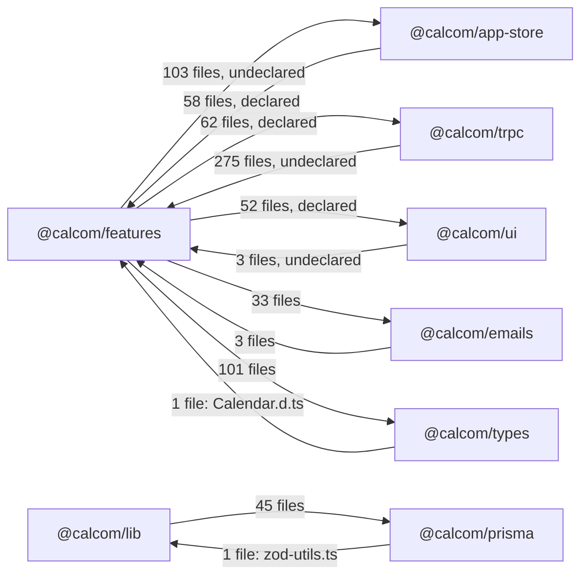

# Dependency analysis: `packages/*` and `apps/web`

Analyzed revision: `f85d2dd` (branch `main`).

## 1. Overview / methodology

This repository is a **Turborepo + Yarn v4 workspaces** monorepo (`packageManager: yarn@4.12.0`, `turbo.json` at the root). Internal packages are wired with the `workspace:*` protocol, e.g. `packages/features/package.json` declares `@calcom/lib`, `@calcom/prisma`, `@calcom/trpc`, `@calcom/ui`, `@calcom/dayjs` and `@calcom/atoms` as `workspace:*`. Root workspace globs are `packages/*`, `packages/embeds/*`, `packages/features/*`, `packages/app-store`, `packages/app-store/*`, `packages/platform/*`, `apps/*`, `apps/api/*`.

Two independent measurements were taken:

1. **Declared dependencies** — the `dependencies` / `peerDependencies` / `devDependencies` blocks of every non-`node_modules` `package.json` under `packages/` and `apps/web` (138 manifests), including nested manifests: `packages/features/package.json`, `packages/features/auth/package.json` (`@calcom/feature-auth`), `packages/features/ee/package.json` (`@calcom/ee`), `packages/features/ee/billing/package.json`, `packages/platform/libraries/package.json`, `packages/app-store/stripepayment/package.json`, and `apps/web/package.json`.
2. **Actual code imports** — every `from "@calcom/…"` / `import("@calcom/…")` / `require("@calcom/…")` specifier in the tracked source files (`.ts`, `.tsx`, `.js`, `.jsx`, `.mjs`, `.cjs`) under `packages/` and `apps/web`. There are 5,608 such files; 3,662 of them contain at least one `@calcom/` specifier and are therefore the only ones that can contribute an edge. Each specifier was resolved to the longest matching workspace package name, then attributed to its owning top-level directory group (`packages/features/**` → `features`, `packages/app-store/**` → `app-store`, `packages/platform/atoms` → `platform/atoms`, …). Test files (`*.test.*`, `*.spec.*`, `*.integration-test.*`, `*.e2e.*`, `__tests__`, `__mocks__`) were counted separately so that test-only edges never masquerade as production edges.

**Reading the counts.** Because edges are aggregated per *directory group*, a group count can exceed a plain grep for one specifier prefix: workspace packages that live inside another group's directory are attributed to that group. The two cases that matter are `@calcom/ee` and `@calcom/billing` (in `packages/features/ee/**` → `features`) and `@calcom/routing-forms` (in `packages/app-store/routing-forms` → `app-store`). Both headline edges are broken down below, so a single-prefix grep and the group total can be reconciled:

| group edge | group total | via the group's main prefix | via sibling packages in the same directory |
|---|---|---|---|
| `features → app-store` | 103 | 100 (`@calcom/app-store/*`) | 3 (`@calcom/routing-forms/*`) |
| `trpc → features` | 275 | 271 (`@calcom/features/*`) | 4 (`@calcom/ee/*` only) |

**The declared graph materially understates the real graph.** Two of the highest-traffic packages declare *zero* `@calcom/*` dependencies:

- `packages/trpc/package.json` (`@calcom/trpc`) declares only `@trpc/*`, `cookie`, `superjson`, `uuid`, `zod` — yet its source imports 10 other workspace groups, reaching into the `features` group alone from 275 non-test files.
- `packages/prisma/package.json` (`@calcom/prisma`) declares only `@prisma/*`, `prisma`, `zod`-family packages — yet `packages/prisma/zod-utils.ts` imports `@calcom/lib/zod/eventType`.

Likewise `packages/features` never declares `@calcom/app-store`, and `packages/ui` never declares `@calcom/features`, although both edges exist in code. Any conclusion drawn only from `package.json` would miss the repository's two most important cycles.

Counts below are "distinct source files containing at least one import" (non-test), with import-statement volume where useful. All counts were regenerated against `f85d2dd`.

## 2. Dependency matrix (from → to)

Legend: **D** = declared in a `package.json` and present in code · **C** = code-only (undeclared) · **d** = declared but no direct code import found in that group · `n prod` = non-test source files · `n test` = test-only source files.

| from → to | app-store | dayjs | emails | features | lib | prisma | trpc | types | ui | platform/* | embeds/* | other |
|---|---|---|---|---|---|---|---|---|---|---|---|---|
| `apps/web` | D 86 prod | D 75 | C 6 | D 568 prod | D 711 prod | D 255 prod | D 364 prod | D(dev) 71 | D 569 prod | C `atoms` 35, D `types` 11, D `constants` 12 | D `embed-core` 14 | d `coss-ui` (`next.config.ts` only), d `app-store-cli`, C `config` 1 |
| `features` | **C 103 prod / 26 test** | D 103 | C 33 prod / 7 test | – | D 358 prod | D 433 prod | D 62 prod | C 101 prod | D 52 prod | D `atoms` 7, C `platform/types` 2 | C `embed-core` 5, C `embed-react` 1 | C `kysely` 2, C `config` 2, C `@calcom/web` 5 prod / 38 test |
| `app-store` | – | D 10 | D 5 | **D 58 prod / 4 test** | D 230 prod | D 152 prod | – | D 154 prod | D 51 prod | C `atoms` 1 | – | C `@calcom/web` 1 prod / 6 test |
| `trpc` | **C 46 prod** | C 14 | C 12 | **C 275 prod / 27 test** | C 138 prod | C 276 prod | – | C 9 prod | C 1 prod | – | – | C `kysely` 2, C `config` 1 |
| `lib` | – | D 19 | C 2 | **C 2 prod** (via `@calcom/ee`) **+ 2 test-harness files** | – | **C 45 prod** | – | D(dev) 22 | – | C `atoms` 1 | C `embed-core` 4 | D `config` 2, C `@calcom/web` 1 |
| `ui` | – | C 1 | – | **C 3 prod** | D 36 prod | C 3 prod | – | C 3 prod | – | – | C `embed-core` 1 | d `config` |
| `emails` | C 3 prod | D 5 | – | **C 3 prod** | D 86 prod | C 10 prod | – | D(dev) 37 | – | – | – | – |
| `prisma` | – | – | – | – | **C 1 prod** (`zod-utils.ts`) | – | – | – | – | – | – | – |
| `types` | C 2 prod | – | – | C 1 prod (`Calendar.d.ts`) | C 1 prod | C 10 prod | – | – | C 1 prod | – | – | – |
| `platform/libraries` | C 3 prod | – | C 1 | **D 12 prod / 97 imports** | D 6 prod | C 3 prod | C 8 prod | C 2 prod | – | – | – | C `config` 1 |
| `platform/atoms` | C 1 | C 12 | – | C 45 prod / 111 imports | C 34 prod | C 15 prod | C 16 prod | C 5 prod | C 25 prod | D `constants` 73, D `types` 72, C `platform/libraries` 2 | C `embed-core` 1 | C `@calcom/web` 30 prod / 82 imports |
| `platform/types` | – | – | – | – | – | – | – | – | – | D `constants` 16, D `enums` 8 | – | – |
| `embeds/embed-core` | – | – | – | – | test-only | C 1 (Playwright harness `playwright/lib/testUtils.ts`) | – | – | – | – | – | test-only `@calcom/web` |
| `embeds/embed-react` | – | – | – | – | – | – | – | – | – | – | D `embed-core` 2, D `embed-snippet` 1 | – |
| `embeds/embed-snippet` | – | – | – | – | – | – | – | C 1 | – | – | D `embed-core` 1 | – |
| `app-store-cli` | – | – | – | – | d | – | – | C 2 prod | – | – | – | – |
| `sms` | – | C 1 | – | C 1 prod / 1 test | C 8 prod | C 1 prod | – | C 10 prod | – | – | – | – |

Leaf / terminal packages (no outgoing `@calcom/*` code edges): `config`, `tsconfig`, `dayjs`, `prisma` (one exception above), `platform/constants`, `kysely`, `debugging`, `coss-ui`.

Two structural observations from the matrix:

- **`packages/debugging` (`@calcom/debugging`) and `packages/coss-ui` (`@coss/ui`) have no inbound code imports** from `packages/*` or `apps/web`. `@coss/ui` is declared by `apps/web` and referenced only in `apps/web/next.config.ts` (transpile config); `@calcom/ui` is the component library actually imported (569 files in `apps/web`).
- **`packages/sms` is not a workspace package at all** — it has no `package.json`, so `@calcom/sms` does not resolve, and no file outside `packages/sms/` references `sms-manager` or `packages/sms`. Its own sources (`packages/sms/sms-manager.ts`) still import `@calcom/features`, `@calcom/lib`, `@calcom/types`, `@calcom/prisma`, `@calcom/dayjs`, i.e. it is orphaned code, not a consumed dependency.

## 3. Circular dependencies

### 3.1 `features ↔ app-store` (strongest cycle)

| direction | non-test files | import statements | declared? |
|---|---|---|---|
| `features → app-store` | **103** (100 via `@calcom/app-store/*` + 3 via `@calcom/routing-forms/*`) | 227 | **No** — `packages/features/package.json` does not list `@calcom/app-store` |
| `app-store → features` | 58 | 101 | Yes — `@calcom/features: workspace:*` in `packages/app-store/package.json` |

`features → app-store` hotspot specifiers: `@calcom/app-store/locations` (28 imports), `/zod-utils` (24), `/delegationCredential` (17), `/utils` (13), `/routing-forms/lib/formSubmissionUtils` (13), `/routing-forms/types/types` (12), `/_utils/getCalendar` (7), `/constants` (4).

Representative files:

- `packages/features/calendars/lib/CalendarManager.ts` → `@calcom/app-store/utils`, `@calcom/app-store/locations`, `@calcom/app-store/_utils/getCalendar`
- `packages/features/conferencing/lib/videoClient.ts` → `@calcom/app-store/getVideoAdapters`, `@calcom/app-store/constants`, `@calcom/app-store/dailyvideo/lib/getDailyAppKeys`
- `packages/features/bookings/lib/getLocationOptionsForSelect.ts` → `@calcom/app-store/locations` (4 imports)
- `packages/features/bookings/lib/handleCancelBooking.ts`, `packages/features/CalendarEventBuilder.ts`, `packages/features/noShow/handleSendingAttendeeNoShowDataToApps.ts`, `packages/features/routing-forms/lib/getUrlSearchParamsToForward.ts`

Reverse edge (`app-store → features`):

- `packages/app-store/_utils/payments/handlePaymentSuccess.ts` → `@calcom/features/bookings/lib/handleConfirmation`, `.../handleBookingRequested`, `.../EventManager`, `@calcom/features/tasker`, `@calcom/features/platform-oauth-client/*`
- `packages/app-store/_utils/getCalendar.ts` → `@calcom/features/calendar-subscription/lib/CalendarSubscriptionService`, `.../cache/CalendarCacheWrapper`, `@calcom/features/flags/features.repository`
- `packages/app-store/_utils/getConnectedApps.ts`, `packages/app-store/googlecalendar/lib/CalendarAuth.ts`, `packages/app-store/delegationCredential.ts`

Note that `packages/app-store/stripepayment/package.json` closes the same loop at manifest level: it declares both `@calcom/app-store` and `@calcom/features`.

### 3.2 `features ↔ trpc`

| direction | non-test files | import statements | declared? |
|---|---|---|---|
| `features → trpc` | 62 | 92 | Yes (`@calcom/trpc: workspace:*`) |
| `trpc → features` | **275** (271 via `@calcom/features/*` + 4 via `@calcom/ee/*`) | 671 | No — `@calcom/trpc` declares zero `@calcom/*` dependencies |

`features → trpc` is dominated by the client surface: `@calcom/trpc/react` (45 imports), `@calcom/trpc/react/hooks/useMeQuery` (3), `@calcom/trpc/server/types` (6) — plus a handful of server reach-ins such as `@calcom/trpc/server/routers/viewer/teams/inviteMember/utils` (11) and `@calcom/trpc/server/routers/viewer/slots/util` (5).

`trpc → features` is concentrated in server handlers: `packages/trpc/server/routers/viewer/slots/util.ts` (`@calcom/features/users/repositories/UserRepository`, `@calcom/features/slots/handleNotificationWhenNoSlots`), `packages/trpc/server/routers/viewer/bookings/confirm.handler.ts`, `packages/trpc/server/routers/viewer/bookings/requestReschedule.handler.ts`. Top specifiers: `@calcom/features/pbac/services/permission-check.service` (60 imports), `@calcom/features/membership/repositories/MembershipRepository` (29), `@calcom/features/users/repositories/UserRepository` (25), `@calcom/features/pbac/domain/types/permission-registry` (20), `@calcom/features/di/watchlist/containers/watchlist` (19).

### 3.3 `features ↔ ui` (smallest, cheapest to break)

| direction | non-test files | import statements | declared? |
|---|---|---|---|
| `features → ui` | 52 | 144 | Yes (`@calcom/ui: workspace:*`) |
| `ui → features` | **3** | 3 | No |

The entire reverse edge is three files:

- `packages/ui/components/avatar/UserAvatarGroup.tsx` → `getBookerBaseUrlSync` from `@calcom/features/ee/organizations/lib/getBookerBaseUrlSync`
- `packages/ui/components/avatar/UserAvatarGroupWithOrg.tsx` → same function
- `packages/ui/components/calendar-switch/CalendarSwitch.tsx` → `import { type ICalendarSwitchProps } from "@calcom/features/calendars/CalendarSwitch"` (type-only)

### 3.4 Near-cycles that are *not* clean one-directional edges

- **`lib → prisma`**: one-directional in practice — 45 non-test files in `packages/lib` import `@calcom/prisma*` (70 imports). The single reverse edge is `packages/prisma/zod-utils.ts` → `@calcom/lib/zod/eventType` (2 imports), so `lib ↔ prisma` is technically a cycle but with a one-file, undeclared reverse edge.
- **`lib → features`**: effectively test-only for `@calcom/features` proper, plus two production files that go through the `@calcom/ee` workspace package (which physically lives in `packages/features/ee`, so it is a directory-level cycle but not a manifest-level `@calcom/features` edge):
  - `packages/lib/formatCalendarEvent.ts` → `@calcom/ee/workflows/lib/reminders/reminderScheduler`
  - `packages/lib/domainManager/organization.ts` → `@calcom/ee/organizations/lib/orgDomains`
  - test harness only: `packages/lib/test/builder.ts` → `@calcom/features/webhooks/lib/interface/IWebhookRepository`, and `packages/lib/server/repository/selectedCalendar.test.ts` → `@calcom/features/flags/config`, `@calcom/features/flags/features.repository`
- **`platform/atoms ↔ apps/web`**: `platform/atoms` imports `@calcom/web/modules/event-types/**` in 30 non-test files (82 imports) while `apps/web` imports `@calcom/atoms` in 35 files. This is a real cycle between the published atoms package and the web app.
- **`emails ↔ features`** and **`types ↔ features`** are tiny cycles of the same shape as `ui ↔ features`: `packages/emails/email-manager.ts`, `packages/emails/templates/_base-email.ts`, `packages/emails/templates/organizer-request-email.ts` reach into `@calcom/features/*`, and `packages/types/Calendar.d.ts` imports `@calcom/features/bookings/lib/getBookingResponsesSchema`.

```mermaid
graph LR
  features["@calcom/features"]
  appstore["@calcom/app-store"]
  trpc["@calcom/trpc"]
  ui["@calcom/ui"]
  lib["@calcom/lib"]
  prisma["@calcom/prisma"]
  emails["@calcom/emails"]
  types["@calcom/types"]

  features -->|"103 files, undeclared"| appstore
  appstore -->|"58 files, declared"| features
  features -->|"62 files, declared"| trpc
  trpc -->|"275 files, undeclared"| features
  features -->|"52 files, declared"| ui
  ui -->|"3 files, undeclared"| features
  lib -->|"45 files"| prisma
  prisma -->|"1 file: zod-utils.ts"| lib
  emails -->|"3 files"| features
  features -->|"33 files"| emails
  types -->|"1 file: Calendar.d.ts"| features
  features -->|"101 files"| types
```

## 4. Coupling hotspots / excessive fan-out

Ranked by number of distinct workspace groups imported from non-test code:

| rank | package | fan-out | targets |
|---|---|---|---|
| 1 | `@calcom/features` | **15** | app-store, dayjs, emails, embed-core, embed-react, kysely, lib, platform/atoms, platform/types, prisma, trpc, types, ui, config, `@calcom/web` |
| 2 | `apps/web` | 14 | app-store, config, dayjs, emails, embed-core, features, lib, platform/atoms, platform/constants, platform/types, prisma, trpc, types, ui |
| 3 | `@calcom/atoms` (`platform/atoms`) | 13 | app-store, dayjs, embed-core, features, lib, platform/constants, platform/libraries, platform/types, prisma, trpc, types, ui, `@calcom/web` |
| 4 | `@calcom/trpc` | 10 | app-store, config, dayjs, emails, features, kysely, lib, prisma, types, ui |
| 5 | `@calcom/lib` | 9 | config, dayjs, emails, embed-core, features, platform/atoms, prisma, types, `@calcom/web` |
| 5 | `@calcom/app-store` | 9 | dayjs, emails, features, lib, platform/atoms, prisma, types, ui, `@calcom/web` |
| 7 | `@calcom/platform-libraries` | 8 | app-store, config, emails, features, lib, prisma, trpc, types |
| 8 | `@calcom/ui` | 6 | dayjs, embed-core, features, lib, prisma, types |
| 8 | `@calcom/emails` | 6 | app-store, dayjs, features, lib, prisma, types |

### 4.1 `@calcom/features` — worst offender

`features` is both the widest fan-out (15 groups) and the biggest inbound target (`apps/web` 568 files, `trpc` 275, `app-store` 58, `platform/atoms` 45). It participates in *all three* confirmed cycles. Its heaviest outbound edges are `prisma` (433 files / 1,039 imports), `lib` (358 / 924), `app-store` (103 / 227), `dayjs` (103), `types` (101).

"God files" — single modules that pull in 4+ other packages:

| file | distinct packages | imported groups |
|---|---|---|
| `packages/features/bookings/Booker/components/hooks/useBookings.ts` | 8 | app-store, dayjs, embed-core, lib, platform/atoms, prisma, trpc, ui |
| `packages/features/bookings/lib/service/RegularBookingService.ts` | 6 | app-store, dayjs, emails, lib, prisma, types |
| `packages/features/bookings/lib/handleCancelBooking.ts` | 6 | app-store, dayjs, emails, lib, prisma, types |
| `packages/features/availability/lib/getUserAvailability.ts` | 5 | app-store, dayjs, lib, prisma, types |
| `packages/features/bookings/lib/handleConfirmation.ts` | 5 | app-store, emails, lib, prisma, types |
| `packages/features/auth/lib/next-auth-options.ts` | 4 | app-store, lib, prisma, types |

Note also that `features` imports `@calcom/web` (the app it is consumed by) in 5 non-test files and 38 test files — the test usage is the booking-scenario harness (`@calcom/web/test/utils/bookingScenario/*`, 100+ imports), but the 5 non-test files (e.g. `packages/features/ee/event-tracking/lib/posthog/provider.tsx`, `packages/features/calendars/weeklyview/index.tsx`, `packages/features/auth/signup/handlers/calcomHandler.ts` → `@calcom/web/pages/api/book/recurring-event`) are a genuine package→app inversion.

### 4.2 `@calcom/trpc` — high fan-out with zero declared dependencies

10 groups, 275 non-test files reaching into `features` alone, plus `prisma` (276 files), `lib` (138), `app-store` (46 files / 80 imports, mostly `@calcom/app-store/delegationCredential` 18 and `/utils` 11) — with **no `@calcom/*` entry in `packages/trpc/package.json`**. Hotspot handlers:

- `packages/trpc/server/routers/viewer/bookings/requestReschedule.handler.ts` — 7 packages (app-store, dayjs, emails, features, lib, prisma, types)
- `packages/trpc/server/routers/viewer/bookings/confirm.handler.ts` — 6 packages, including `@calcom/app-store/locations`
- `packages/trpc/server/routers/viewer/slots/util.ts` — 5 packages, and is itself imported back by `features`

### 4.3 `@calcom/app-store`

9 groups: `lib` (230 files), `types` (154), `prisma` (152), `features` (58), `ui` (51), `dayjs` (10), `emails` (5), `platform/atoms` (1), `@calcom/web` (1). All except `platform/atoms` and `@calcom/web` are declared. Its `_utils/` directory is where the cycle with `features` is concentrated.

### 4.4 Architecturally expected fan-out

- **`apps/web` (14)** — top-level Next.js application; fanning out to every package is by design. Its declared manifest is the most complete in the repo (17 `workspace:*` entries).
- **`@calcom/platform-libraries` (8)** — an intentional re-export shim: `packages/platform/libraries/index.ts` is 140 lines of imports/re-exports from `@calcom/features/*`, `@calcom/lib/*`, `@calcom/prisma/*` and `@calcom/trpc/server/routers/viewer/teams/inviteMember/utils`, re-exported for API v2. High fan-out here is the package's purpose, but it declares only `@calcom/features` and `@calcom/lib`.
- **`@calcom/atoms` (13)** — the published React SDK; its fan-out is expected, except for the `platform/atoms → @calcom/web` edge (30 files), which is not.

## 5. Prioritized refactoring recommendations

Ordered lowest-risk / highest-certainty first.

### R1. Break `ui → features` (3 files, ~1 hour of work)

- Move `getBookerBaseUrlSync` from `packages/features/ee/organizations/lib/getBookerBaseUrlSync` into `@calcom/lib` (`ui` already declares and imports `@calcom/lib` in 36 files), then update `packages/ui/components/avatar/UserAvatarGroup.tsx` and `packages/ui/components/avatar/UserAvatarGroupWithOrg.tsx`.
- Define `ICalendarSwitchProps` in `@calcom/ui` (next to `packages/ui/components/calendar-switch/CalendarSwitch.tsx`) and have `packages/features/calendars/CalendarSwitch.tsx` import the type from `ui` instead of the reverse. The current import is type-only, so this is a compile-time-only change.

Result: `ui` becomes a strict downstream leaf of `features`, and one of three cycles disappears entirely.

### R2. Extract shared app primitives into a lower leaf package

23 of the 100 `features` files that import `@calcom/app-store/*` import *only* `@calcom/app-store/locations`, `/constants`, `/utils` or `/zod-utils`. Extracting those four modules into a new leaf package (e.g. `@calcom/app-config` or `packages/app-store-primitives`) that depends on nothing but `types`/`lib` immediately removes ~23 files from the cycle and downgrades the remaining edges, because `features` and `app-store` would both depend *downward* on the new package:

- `@calcom/app-store/locations` — 21 files in `features` (28 imports), also imported by `trpc` and `emails`
- `@calcom/app-store/utils` — 11 files in `features`, 11 imports in `trpc`
- `@calcom/app-store/constants` — 4 files in `features`
- `@calcom/app-store/zod-utils` — 22 files in `features`

Do this before R3: `packages/features/bookings/lib/getLocationOptionsForSelect.ts` (4 imports of `locations`) becomes a pure leaf consumer.

### R3. Invert the runtime adapter edges (`getCalendar`, `getVideoAdapters`)

The remaining hard part of `features ↔ app-store` is runtime app resolution: `packages/features/calendars/lib/CalendarManager.ts` calls `@calcom/app-store/_utils/getCalendar` and `packages/features/conferencing/lib/videoClient.ts` calls `@calcom/app-store/getVideoAdapters`, while `packages/app-store/_utils/getCalendar.ts` calls back into `@calcom/features/calendar-subscription/*`.

Define the adapter interfaces (`Calendar`, `VideoApiAdapter` already live in `@calcom/types`) plus a registry contract in a low package, have `features` depend only on the registry interface, and let the composition root (`apps/web`, `apps/api/*`, `platform/libraries`) register the `app-store` implementations at boot. This is the standard registry / dependency-injection inversion and is the only way to remove the last `features → app-store` runtime edges without moving business logic.

### R4. Split `@calcom/trpc` into client-types and server-router layers

`features → trpc` is 45 of 92 imports through `@calcom/trpc/react` (a client/type surface), while `trpc → features` is 671 imports from server handlers. Splitting the package (e.g. `@calcom/trpc-client` consumed by `features`, and `@calcom/trpc-server` consuming `features`) turns a cycle into a linear chain `trpc-client → features → …` / `trpc-server → features`. Prerequisite cleanup: the ~16 server reach-ins from `features` (`@calcom/trpc/server/routers/viewer/teams/inviteMember/utils`, `@calcom/trpc/server/routers/viewer/slots/util`) must move into `features` or a shared service package first.

Independently, `packages/trpc/package.json` should declare its real `@calcom/*` dependencies — today the manifest claims none of the 10 groups it imports, which defeats Turborepo task graph pruning and any lint rule that could enforce boundaries.

### R5. Follow-up cleanups

- `packages/prisma/zod-utils.ts` → `@calcom/lib/zod/eventType`: move that schema into `@calcom/prisma` (or a leaf schema package) so `prisma` is a true leaf.
- Declare the undeclared-but-real edges (`features → app-store`, `features → types`, `trpc → *`, `ui → *`) so the declared graph matches reality, then add a boundary check (e.g. `dependency-cruiser` in CI) to keep new cycles from landing.
- `platform/atoms → @calcom/web` (30 files) should be inverted: shared event-type tab components belong in a package, not in the app that `atoms` is published alongside.
- `packages/sms` has no `package.json` and no importers — either promote it to a workspace package or delete it. `packages/debugging` and `packages/coss-ui` have no inbound code imports either.

### Breaking-change impact

Internal refactors here are **import-path churn, not semver-breaking changes**. Every internal package except `@calcom/billing` (see below) is `"private": true` with `"version": "0.0.0"` or `"1.0.0"` and is consumed exclusively through `workspace:*` (`@calcom/features`, `@calcom/lib`, `@calcom/ui`, `@calcom/app-store`, `@calcom/trpc`, `@calcom/prisma`, `@calcom/types`, `@calcom/dayjs`, `@calcom/emails`, `@calcom/config`, `@calcom/tsconfig`, `@calcom/kysely`, `@coss/ui`, …), so moving a module only requires updating in-repo importers.

The externally visible surface — where changes *are* breaking — is:

- `@calcom/atoms` (`packages/platform/atoms`, publishable, `2.2.0`)
- `@calcom/embed-core` (`1.5.3`), `@calcom/embed-react` (`1.5.3`), `@calcom/embed-snippet` (`1.3.3`)
- `@calcom/platform-libraries` (`packages/platform/libraries/package.json`, not marked private) — its `index.ts` re-export list is the contract consumed by API v2, so R1–R4 must keep those named exports stable even while their implementation moves.

One more manifest is missing `private: true` without being a real external surface: `@calcom/billing` (`packages/features/ee/billing/package.json`, `version: "1.0.0"`). It has no `publishConfig`, is not on the public npm registry, and no workspace declares or imports it, so it carries no external consumers today — but the missing `private` flag makes it publishable by accident and should be added.

Recommended sequencing: **R1 → R2 → R5 (declare edges + CI boundary check) → R3 → R4**, keeping the `platform/libraries` re-export surface fixed throughout.
